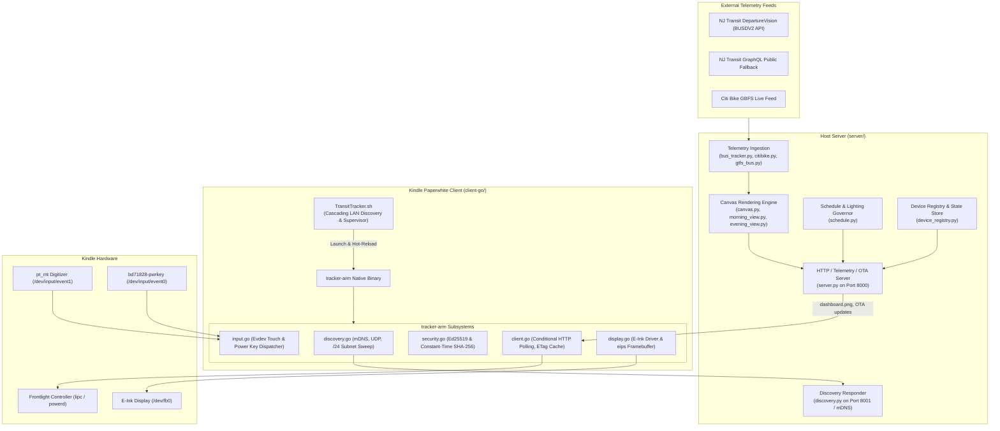

# Architecture & System Design

The **Hoboken Transit Tracker** is a multi-tier system engineered to deliver real-time transit and micro-mobility telemetry to ultra-low-power e-ink displays (specifically jailbroken Amazon Kindle Paperwhite devices) with minimal energy consumption and cryptographic verification.

---

## 1. System Topology

---

## 2. Server Architecture (`server/`)

The server runs on standard Linux/macOS hosts, home servers, or Raspberry Pis using Python 3.11+.

### 2.1 Dual-Redundancy Arrival Engine
- **Primary Source**: `NJTransitBusTracker` queries the NJ Transit DepartureVision BUSDV2 XML endpoint for Route 126 arrivals at designated stop IDs (`#20512` at Washington & 9th; `#20494` at Clinton & 9th).
- **Secondary Fallback**: If BUSDV2 encounters network timeouts, schema changes, or HTTP errors, the tracker automatically falls back to NJ Transit's public GraphQL endpoint without interrupting the client.
- **GTFS Bus Tracker**: `GTFSBusTracker` (`server/gtfs_bus.py`) indexes static GTFS timetables with GTFS-RT protocol buffers to compute ETA predictions even when primary feeds are impaired.
- **Citi Bike Telemetry**: `CitiBikeTracker` (`server/citibike.py`) consumes public GBFS JSON feeds for live station availability and prioritizes e-bikes and open docks across 6 key neighborhood hubs.

### 2.2 Dynamic Layout & Resolution Engine
- **Resolution Native Rendering**: The server renders images at the client's native panel resolution (e.g. 1648×1236 for Kindle Paperwhite 5) rather than upscaling an 800px bitmap. Text and vector glyphs are rendered with subpixel font metrics directly to the target canvas.
- **Morning vs. Evening Hero Views**:
  - `morning` (5:00 AM – 12:00 PM): Hero presentation focused on Citi Bike availability for the morning NYC commute.
  - `evening` (12:00 PM – 5:00 AM): Hero presentation prioritizing Route 126 inbound/outbound bus departures.
  - `auto`: Automatically selects the optimal view based on current local time.
- **`ScaledDraw` Proxy**: Located in `server/canvas.py`, wraps Pillow's `ImageDraw` to scale coordinates, bounding boxes, and font sizes linearly according to the requested display scale.

### 2.3 Schedule & Lighting Governor (`server/schedule.py`)
- **Peak Commute Detection**:
  - Morning Peak: 7:30 AM – 9:30 AM
  - Evening Peak: 4:30 PM – 7:00 PM
  - Weekends are off-peak by default unless `PEAK_WEEKENDS=1`.
- **Dynamic Polling Advertisements**:
  - Peak: 60-second polling interval (interactive presentation).
  - Off-Peak: 600-second (10-minute) interval (idle presentation).
  - Overnight: 3600-second (1-hour) deep-eco window (dormant presentation).
- **Ambient Lighting**: Fixed schedule signals the Kindle to engage warm frontlight levels (brightness 8, warmth 12) during peak commutes, and 0/0 off-peak.

### 2.4 Multi-Device Fleet Registry (`server/device_registry.py`)
- **Auto-Registration**: Any incoming request containing `X-Tracker-Client-ID` is automatically registered without prior manual provisioning.
- **Isolated Per-Device State**:
  - Telemetry: IP address, battery percentage, charging state, client version, firmware version, and last-seen timestamp.
  - Command Queues: Isolated queues for `X-Tracker-Action` (e.g. `restart`, `reboot`, `update`) and `X-Tracker-Diag` (`quick`, `full`).
  - Storage: Per-device diagnostic logs and dumps stored under `<cache_dir>/devices/<client_id>/`.

---

## 3. Client Architecture (`client-go/`)

The Kindle client is a statically linked Go binary compiled for Linux ARMv7 (`CGO_ENABLED=0 GOOS=linux GOARCH=arm GOARM=7`).

### 3.1 Subsystems Breakdown

| Subsystem | Source File | Responsibility |
|---|---|---|
| **Discovery** | `client-go/discovery.go` | Implements LAN autodiscovery via mDNS, UDP broadcast (`TRANSIT_TRACKER_DISCOVER` on port 8001), and `/24` subnet sweeps. Rejects non-private or public addresses. |
| **HTTP Engine** | `client-go/client.go` | Manages conditional polling loop (`If-None-Match` / `ETag`), keep-alive connections, exponential backoff, and header injection (`X-Tracker-Client-ID`, `X-Kindle-Battery`). |
| **Security** | `client-go/security.go` | Validates server identity certificates and response signatures using Ed25519 and `crypto/subtle.ConstantTimeCompare`. |
| **Event Router** | `client-go/input.go` | Asynchronously reads Linux evdev input streams (`/dev/input/event1` touch, `/dev/input/event0` power key). Decodes single taps, double taps (< 380ms), and button bar coordinates. |
| **Display Driver** | `client-go/display.go` | Writes raw grayscale images to `/sys/class/graphics/fb0` or invokes the Kindle native `eips` utility for clean e-ink waveform refreshes. |
| **OTA Supervisor** | `client-go/main.go` | Detects new versions advertised by the server, validates the signed manifest against the embedded release key, writes to disk, and replaces the running process via `syscall.Exec`. |

### 3.2 Client Identification
The Go client establishes identity in `client-go/client_id.go`:
1. Queries Kindle hardware serial via `lipc-get-prop com.lab126.system serialNumber`.
2. Falls back to a persistent RFC 4122 v4 UUID in `/mnt/us/documents/tracker_client_id.txt` (or `/tmp/tracker_client_id.txt` on non-Kindle systems).
3. Attaches `X-Tracker-Client-ID: <id>` to every HTTP communication.

---

## 4. Bootstrap Launcher (`client-go/launcher/TransitTracker.sh`)

A POSIX-compliant shell script that acts as the supervisor on the Kindle device:
1. **Network Initialization**: Waits for Wi-Fi interface connectivity (`wlan0`).
2. **Cascading LAN Discovery**:
   - Tier 1: Probes `transit-tracker.local:8000` via mDNS.
   - Tier 2: Queries the default gateway IP from `/proc/net/route` on port 8000.
   - Tier 3: Executes a parallel `/24` subnet sweep probing `/healthz` and `/identity`.
3. **Atomic Persistence**: Persists discovered server URL to `/mnt/us/documents/tracker_server.txt`.
4. **Binary Bootstrap & Recovery**: Downloads `tracker-arm`, validates the ELF magic bytes (`\x7fELF`), maintains a verified backup copy, and invokes the binary. If a new binary fails, it rolls back automatically to the backup copy.
